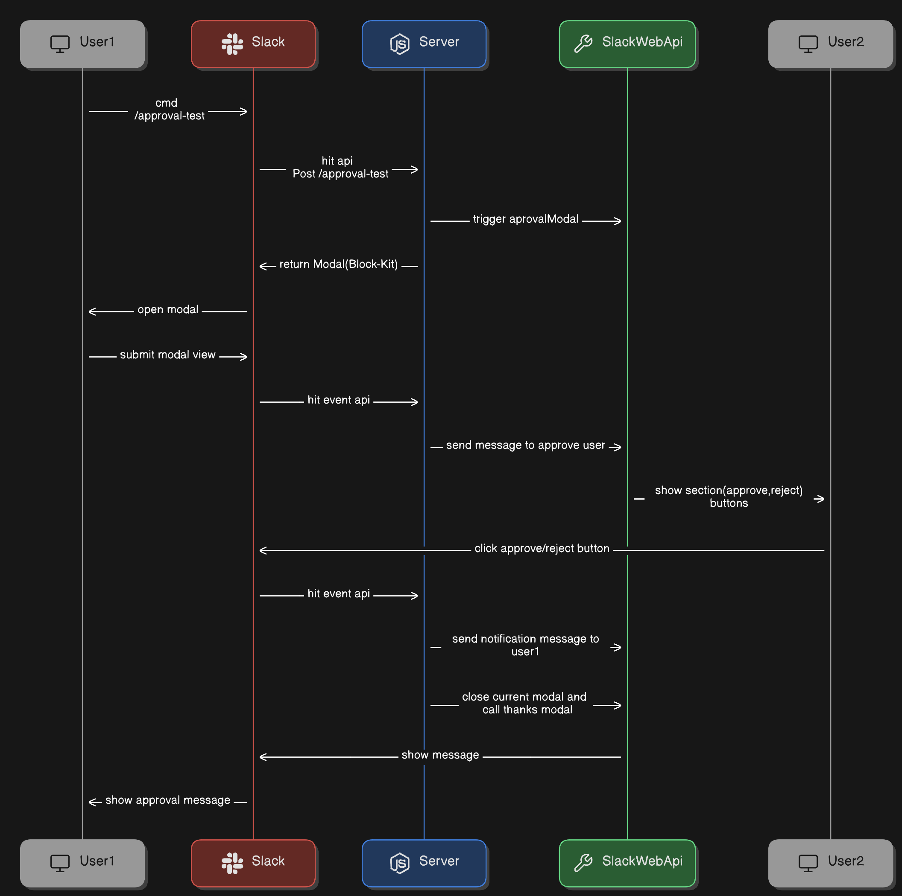

## About

This is an simple Slack Bot app Demo, userA can send an approval request to userB.

userB either approve or reject the request

userA notified about request

## Required token and account

slack token is required // could be get from https://api.slack.com/apps > Install App > Bot User Oauth Token

## Available Scripts to run expressjs server

### `npm run dev` or `npm run dev:hot` (hot reloading)

Run the server in development mode.

### `npm test` or `npm run test:hot` (hot reloading)

Run all unit-tests.

### `npm test -- "name of test file" (i.e. users).`

Run a single unit-test.

### `npm run lint`

Check for linting errors.

### `npm run build`

Build the project for production.

### `npm start`

Run the production build (Must be built first).

## Additional Notes

- If `npm run dev` gives you issues with bcrypt on MacOS you may need to run: `npm rebuild bcrypt --build-from-source`.

## setup apis to slack app

### Slash Command APi setup

goto https://api.slack.com/apps/ > Slash Command > create a new command > put apprpriate field data >

in the request URL put <your-sever.com>/api/slack/approval-test

### Interactivity & Shortcuts Api setup

goto https://api.slack.com/apps/ > Interactivity & Shortcuts

in the request URL put <your-sever.com>/api/slack/events

## architecture diagram

